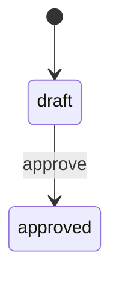

# Order Approval Spec

| Metadata | Value |
|---|---|
| Version | 1.0.0 |
| Owner | Order operations |
| Created date | 2026-09-04 |

## 1. Module Definition

The module accepts or rejects an order approval request. Out of Scope: payment
capture and inventory reservation.

## 2. State Model

| State | Meaning | Entry condition | Allowed operation |
|---|---|---|---|
| draft | The request is editable. | A requester creates it. | Submit |
| approved | The request is final. | An approver accepts it. | Read |

## 3. Functional Requirements

FR-001: An approver accepts one submitted order request.

AC-001: Given a submitted request, when the approver accepts it, then its
state becomes approved and the response identifies the order.

CASE-001 covers the normal path. CASE-002 covers invalid input, boundary
values, timeout, retry, and recovery behavior.

## 4. Key Entities

An order request has one stable identifier and one current state.

## 5. Data Fields

The order identifier is a required string of 1 to 64 characters.

## 6. Non-functional Requirements

| NFR ID | Decision | Target | Verification |
|---|---|---|---|
| NFR-GEN-001 | Adopted | 500 milliseconds | Contract test |

## 7. Success Criteria

SC-01: Every accepted request persists the approved state exactly once.

## 8. References and Compliance

The order governance policy version 2.0 is the selected authority.

## 9. Key Decisions

| Decision ID | Question | Outcome | Rationale | Date |
|---|---|---|---|---|
| D-01 | Who approves? | Order operations | It owns approval risk. | 2026-09-04 |

## 10. Dependencies and Assumptions

| Dependency | Requirement | Fallback |
|---|---|---|
| Order store | Read and write order state. | Return an explicit unavailable result. |

## 11. Stage Differences

The first release contains FR-001 only.

## 12. Revision History

Revision 1.0.0 established the first approved baseline on 2026-09-04.
