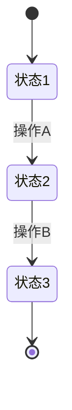

# 产品功能规约（Spec）：{功能名称}

> **Policy role**: This is the recommended product Spec authoring template.
> It becomes an exact structural requirement only when the user or governing
> project policy explicitly selects `strict-12-chapter`. The default
> `product-spec` audit is content-first and accepts equivalent layouts.

> **模版说明**：本文档面向 PM + 后端开发，是 BRD 到开发的桥梁。描述“系统做什么”，不描述“界面长什么样”（见 frontend-spec.md）。
> 篇幅目标 10-25KB。

| 元信息 | 内容 |
|---|---|
| 功能分支 | `{branch-name}` |
| 创建日期 | YYYY-MM-DD |
| 状态 | 草稿 / 评审中 / 已确认 |
| 业务 Owner | {姓名/角色} |
| 基线版本 / commit | {版本或 commit} |
| 阻断未决问题 | 无 / {问题与 Owner} |
| 输入来源 | brd.md, user-stories.md |
| 关联文档 | brd.md, user-stories.md, frontend-spec.md, data-model.md, contracts/api.md, plan.md |

---

## 1. 模块定义

### 1.1 一句话目标

{一句话描述本模块做什么}

### 1.2 模块边界

**包含**：
- {模块负责的业务能力1}
- {模块负责的业务能力2}

**不包含**：
- {明确排除的能力1}
- {明确排除的能力2}

### 1.3 上下游依赖

| 方向 | 系统/模块 | 依赖内容 | 不可用时的降级策略 |
|---|---|---|---|
| 上游 | {系统A} | {依赖的数据或服务} | {降级方案} |
| 下游 | {系统B} | {提供给对方的能力} | - |

---

## 2. 状态模型

### 2.1 状态定义

| 状态 | 含义 | 进入条件 | 可执行操作 |
|---|---|---|---|
| {状态1} | {业务含义} | {何时进入} | {允许的操作} |
| {状态2} | | | |

### 2.2 状态流转



### 2.3 状态相关业务规则

| 规则ID | 描述 |
|---|---|
| SR-01 | {状态相关的约束规则} |
| SR-02 | |

---

## 3. 功能需求清单

> FR 按业务域分组。每条 FR 描述规则和关键验收条件；每个 AC 使用稳定 ID，并在其下列出可执行 CASE。
> 与 user-stories.md 中的用户故事一一对应，不重复用户故事原文。

### 3.1 {业务域1：如“录入与表单”}

#### FR-001：{功能名称} [阶段: 原型]

**描述**：{一句话功能描述}

**关联用户故事**：US-1

**输入**：
- {输入项1}（来源：{用户输入/系统带出/外部查询}）
- {输入项2}

**处理**：
1. {处理步骤1}
2. {处理步骤2}

**输出**：
- {输出项1}（去向：{页面展示/持久化/通知}）

**业务规则**：
| 规则 | 说明 |
|---|---|
| {规则1} | {详细说明} |

**关键 AC**：

**AC-FR001-01：{一个可独立判断通过或失败的结果}**

1. **CASE-01**：Given {前置条件}，When {动作}，Then {可观察结果}。
2. **CASE-02**：Given {异常或边界条件}，When {动作}，Then {可观察失败结果}。

---

#### FR-002：提交校验 [阶段: 原型]

**描述**：提交前执行字段级完整性和合规性校验。

**关键 AC**：

**AC-FR002-01：所有字段校验通过后允许提交**

1. **CASE-01**：Given 所有必填字段和业务规则均满足，When 用户提交，Then 系统接受提交并返回成功结果。

**AC-FR002-02：字段校验失败时阻止提交**

1. **CASE-01**：Given 任一字段不满足第 5 章规则，When 用户提交，Then 系统拒绝提交并返回可定位到字段的校验结果。

> 字段级校验规则见 §5 数据字段定义。

---

### 3.2 {业务域2：如“审批流转”}

#### FR-003：{功能名称} [阶段: MVP]

**描述**：

**关联用户故事**：US-2

**输入**：

**处理**：

**输出**：

**业务规则**：
| 规则 | 说明 |
|---|---|

**关键 AC**：

**AC-FR003-01：{一个可独立判断通过或失败的结果}**

1. **CASE-01**：Given {前置条件}，When {动作}，Then {可观察结果}。

---

## 4. 关键实体

| 实体 | 含义 | 核心属性（概要） | 关联 |
|---|---|---|---|
| {Entity1} | {业务含义} | {字段1, 字段2, ...} | → {Entity2} |

> 实体关系图：
> ```mermaid
> erDiagram
>     Entity1 ||--o{ Entity2 : has
> ```

---

## 5. 数据字段定义

> **本节是字段规格的唯一真相来源（Single Source of Truth）。**
> - 前端开发：见 frontend-spec.md，引用本表字段名，补充 UI 约束（错误提示、展示格式、校验时机）
> - 后端开发：见 data-model.md，引用本表字段名，补充 DB 层约束（DB 类型、索引、主外键）
> - 接口开发：见 contracts/api.md，引用本表字段名，补充请求/响应结构

### 5.1 {实体/章节名称}

| 序号 | 字段名 | 业务含义 | 类型 | 长度/精度 | 必填 | 默认值 | 取值范围/约束 | 校验规则 |
|---|---|---|---|---|---|---|---|---|
| 1 | {fieldName} | {一句话业务含义} | string/number/decimal/date/datetime/enum/file/boolean | {如 32 / (18,2) / -} | 是/否/条件 | {默认值或 -} | {取值范围或约束条件} | {如 非空 / >0 / ∈{A,B,C} / 正则} |
| 2 | {fieldName} | | | | | | | |

### 5.2 {实体/章节名称}

| 序号 | 字段名 | 业务含义 | 类型 | 长度/精度 | 必填 | 默认值 | 取值范围/约束 | 校验规则 |
|---|---|---|---|---|---|---|---|---|
| 1 | | | | | | | | |

---

## 6. 非功能性需求选择

> 必须依据当前项目指定或 skill 内置的 `nfr-catalog.md` 逐项选择。Agent 可以推荐，不能批准豁免；“不适用”与“豁免”不得留空理由。

| NFR ID | 结论（采用 / 不适用 / 豁免） | 适用理由 / 不适用理由 / 豁免风险与替代控制 | 目标值 | 验证方式 | 豁免批准人 / 到期日 |
|---|---|---|---|---|---|
| NFR-GEN-001 | 采用 | | | | - |
| NFR-GEN-002 | 采用 | | | | - |
| NFR-GEN-003 | 采用 | | 100% 规约覆盖 | 追溯矩阵 | 不可豁免 |
| NFR-GEN-004 | 采用 | | | | - |
| {场景必选 NFR} | | | | | |

### 6.1 NFR 选择确认

- [ ] 通用必选已全部处理
- [ ] 写操作 / 外部集成 / 敏感数据 / 批量报表的适用项已处理
- [ ] 所有豁免都有风险、替代控制、批准人和到期日
- [ ] 每条“采用”的 NFR 都有验证证据或计划

---

## 7. 成功标准

> 每条标准必须可衡量、可验证。不可复述功能需求。

| ID | 标准 | 衡量方式 |
|---|---|---|
| SC-01 | {可衡量的结果描述} | {如何衡量} |
| SC-02 | | |

---

## 8. 参考资料与合规依据

| 资料 | 类型 | 说明 |
|---|---|---|
| {文档名/URL} | {BRD/PRD/制度文件/技术规范} | {相关内容} |

---

## 9. 关键决策记录

> 从 Clarifications 和 brainstorm 提炼。

| 决策ID | 问题 | 结论 | 理由 / 取舍 | 日期 |
|---|---|---|---|---|
| D-01 | {问题} | {结论} | {为什么这样决定、放弃了什么方案、影响哪些对象} | YYYY-MM-DD |

---

## 10. 依赖与假设

### 10.1 假设

- {假设1}
- {假设2}

### 10.2 设计约束

- {约束1：如治理规范要求}
- {约束2：如技术栈限制}

---

## 11. 阶段差异说明

> 仅列出各阶段之间的关键差异，详细拆解见 plan.md。

| 功能 | 原型阶段 | MVP阶段 | 完整阶段 |
|---|---|---|---|
| FR-001 | 基本实现 | - | - |
| FR-002 | 基本校验 | +附件校验 | +高级校验 |
| FR-003 | - | 基本审批流 | +退回/加签 |

---

## 12. 修订记录

| 版本 | 日期 | 修订人 | 修订内容 |
|---|---|---|---|
| v1.0 | YYYY-MM-DD | {作者} | 初稿 |
